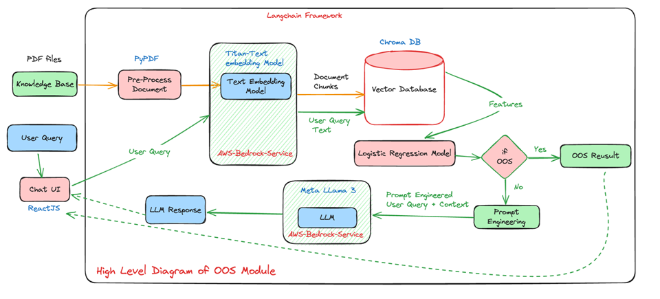
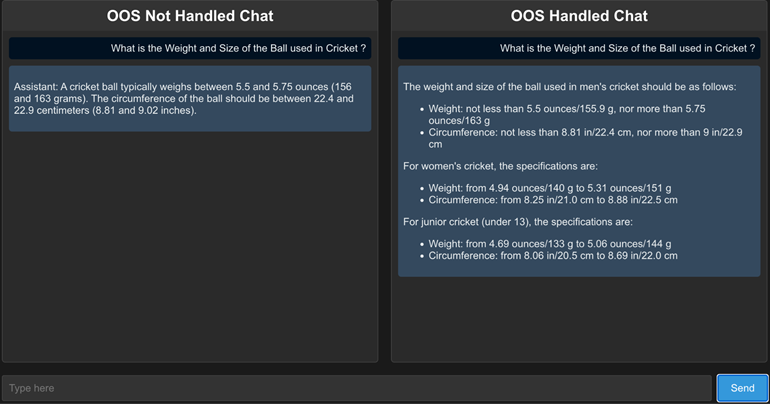

# Improved-RAG-Pipeline
# Module 2: Out of Scope Handling

Out-of-Scope (OOS) queries in the context of Large Language Models (LLMs) refer to user questions or inputs that fall outside the knowledge domain or the intended operational scope of the model. This project focuses on identifying and handling such OOS queries using state-of-the-art methodologies.

## State of the Art Methodologies

### 1. Rule-based Approaches
- Utilizes predefined rules to determine whether a query falls within the scope of the LLM.

### 2. Fine Tuning Large Language Models
- Involves fine-tuning LLMs on specific datasets to better recognize in-scope and out-of-scope queries.

### 3. Retrieval-Augmented Generation (RAG)
- Combines retrieval of relevant information with the generative capabilities of LLMs to provide more accurate and contextually appropriate responses.

## Approach - Overview

The approach taken in this project combines several techniques:
- **Traditional RAG**: A baseline system that integrates retrieval mechanisms with language generation.
- **OOS Detection Model**: A machine learning model designed to identify out-of-scope queries.
- **Prompt Engineering**: Crafting prompts to better guide the LLM in handling queries effectively.

These components are integrated into a comprehensive pipeline, along with a user-friendly frontend interface.

## High-Level Architecture
### High Level Architecture Diagram of OOS Handling Pipeline


The architecture of the OOS Handling Pipeline includes the following key components:
1. **RAG System**: Retrieves relevant information and augments the response generation process.
2. **OOS Detection Model**: Classifies whether a query is in-scope or out-of-scope.
3. **Prompt Engineering**: Tailors prompts to refine the interaction with the LLM.
4. **Frontend Interface**: Provides an accessible user interface for interacting with the system.

## OOS Detection Model

The OOS Detection Model plays a critical role in classifying the scope of user queries. Below are the key aspects of the model:

- **Machine Learning Approach**: Utilizes a supervised learning model to classify queries.
- **Dataset**: A labeled dataset of queries is used to train and validate the model.
- **Algorithm**: Logistic Regression is employed for classification.
- **Vector Similarity Analysis**: Analyzes similarity scores between user queries and their top relevant chunks.
- **Embedding Model**: Uses AWS Titan Text Embedding to convert text into numerical vectors for similarity analysis.
## Implementation

## Getting Started

### Prerequisites
- Python 3.8 or higher
- Required libraries: `numpy`, `pandas`, `scikit-learn`, `transformers`, `flask` (for the frontend), and `boto3` (for AWS integration).

### Installation
1. Clone the repository:
   ```bash
   git clone https://github.com/your-repo/out-of-scope-handling.git
